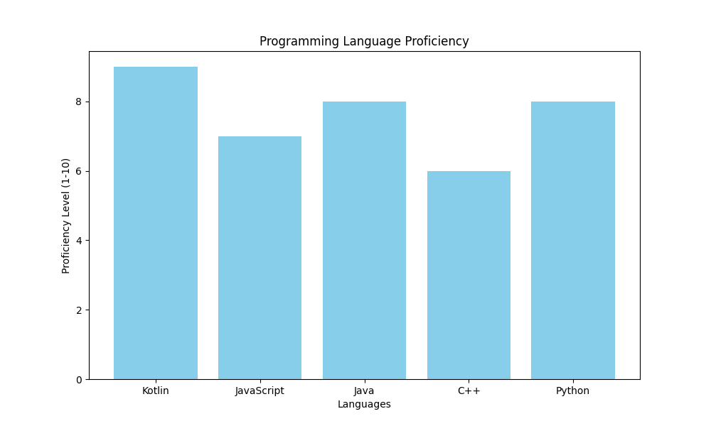
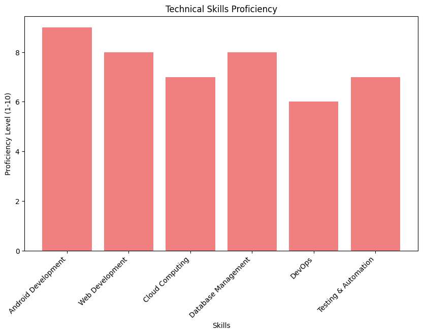

# **BRIAN KIPTOO**

## **About Me**
I am a software engineer with a passion for coding and continuous learning. 
Over the years, I've worked on diverse projects, specializing in building scalable and efficient software solutions. 
I have a broad skill set across different programming languages and technologies. 
This README provides a summary of my technical skills and areas of proficiency.

## **Programming Language Proficiency**
I have expertise in a variety of programming languages, and here is a breakdown of my proficiency levels

## **Technical Skills**
In addition to programming languages, I have honed various technical skills across different areas of software engineering. 
Below is a summary of my skillset, ranging from front-end to back-end, cloud, DevOps, and more

## **Skills Overview**
### **Android Development**
* Native adroid development
* Firebase
* Android UI/UX Design
### **Web Development:**
* HTML, CSS, JavaScript, React, Angular
* UI/UX Design Principles
* Responsive Web Design
* Version Control (Git)
* Node.js, Express, Django
* REST APIs & Microservices
* Authentication & Authorization (JWT, OAuth)
* Performance Optimization
### **Cloud Computing:**
* AWS, Google Cloud
* Serverless Architecture
* Cloud Deployment & Scaling
### **Database Management:**
* SQL (MySQL, PostgreSQL)
* NoSQL (MongoDB, Firebase)
* Data Modeling & Query Optimization
### **DevOps:**
* Continuous Integration & Continuous Deployment (CI/CD)
* Docker, Kubernetes
* Infrastructure as Code (Terraform, CloudFormation)
### **Testing & Automation:**
* Unit Testing (Jest, Mocha, PyTest)
* Test-Driven Development (TDD)
* Selenium, Cypress for End-to-End Testing

## **Contact**
Feel free to reach out to me through the following:
* **Email:** *bkiptoo553@gmail.com*
* **GitHub:** *https://github.com/bkiptoo553*
